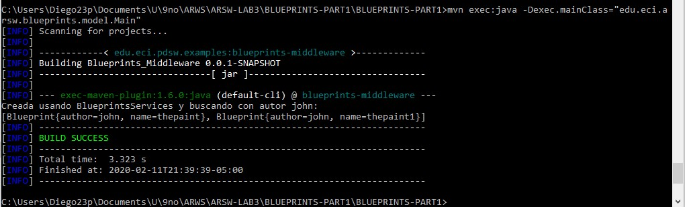
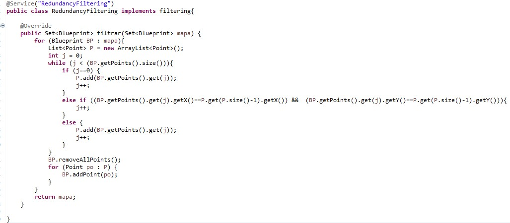

# Blueprint Management 1

## Part I

Configure the application to work under a dependency injection scheme, as shown in the previous diagram.
The above requires:
1. Add the dependencies of Spring. Add the Spring settings. Configure the application - by means of annotations - so that the persistence scheme is injected when the BlueprintServices bean is created. Complete the getBluePrint() and getBlueprintsByAuthor() operations. Implement everything required from the lower layers (for now, the available persistence scheme InMemoryBlueprintPersistence) by adding the corresponding tests in InMemoryPersistenceTest.

    Inyeccion de InMemoryBlueprintPersistence:
    
    
    
    Método a alto nivel (En BlueprintsServices)
    
    
    
    Método a bajo nivel (En InMemoryBlueprintPersistence)
    
    
    
    Test correspondientes para getBlueprint y getBlueprintsByAuthor:
    
    
    
    Compilación de Test:
    
    

2. Make a program in which you create (through Spring) an instance of BlueprintServices, and rectify its functionality: register plans, consult plans, register specific plans, etc.

    Main:
    
    
    
    Código para compilar:
    
    - mvn exec:java -Dexec.mainClass="edu.eci.arsw.blueprints.model.main"
    
    Resultados:
    
    

3. You want the plan query operations to perform a filtering process, before returning the planes consulted. These filters are looking to reduce the size of the plans, removing redundant data or simply sub-sampling, before returning them. Adjust the application (adding the abstractions and implementations you consider) so that the BlueprintServices class is injected with one of two possible 'filters' (or possible future filters). The use of more than one at a time is not contemplated:
    1. (A) Redundancy filtering: deletes consecutive points from the plane that are repeated.

	Código de RedundancyFiltering:

	

	Se evidencia que se eliminan todos los puntos repetidos despues de filtrar:

	

    2. (B) Subsampling filtering: suppresses 1 out of every 2 points in the plane, interspersed. 
4. Add the corresponding tests to each of these filters, and test its operation in the test program, verifying that only by changing the position of the annotations - without changing anything else - the program returns the filtered planes in the way (A) or in the way (B).
