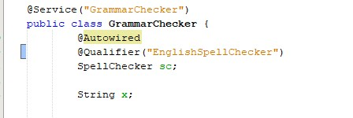
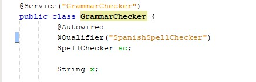
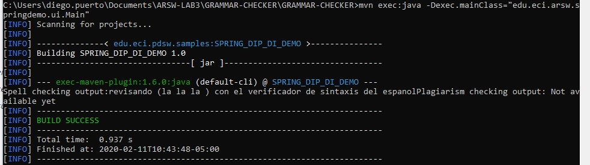

# Introducción a Spring y configuración usando anotaciones

## Part I - Basic workshop 

To illustrate the use of the Spring framework, and the development environment for its use through Maven (and NetBeans), the configuration of a text analysis application will be made, which makes use of a grammar verifier that requires a spelling checker. The grammar checker will be injected, at the time of execution, with the spelling checker required (for now, there are two available: English and Spanish).

1. Open the project sources in NetBeans.
2. Review the Spring configuration file already included in the project (src / main / resources). It indicates that Spring will automatically search for the 'Beans' available in the indicated package.
3. Making use of the Spring configuration based on annotations mark with the annotations @Autowired and @Service the dependencies that must be injected, and the 'beans' candidates to be injected -respectively-:
    1. GrammarChecker will be a bean, which depends on something like 'SpellChecker'.
    2. EnglishSpellChecker and SpanishSpellChecker are the two possible candidates to be injected. One must be selected, or another, but NOT both (there would be dependency resolution conflict). For now, have EnglishSpellChecker used. 
4. Make a test program, where an instance of GrammarChecker is created by Spring, and use it.

Configuración en inglés:

Resultados en inglés:

## Part II

1. Modify the configuration with annotations so that the Bean 'GrammarChecker' now makes use of the SpanishSpellChecker class (so that GrammarChecker is injected with EnglishSpellChecker instead of SpanishSpellChecker.) Verify the new result.

Configuración en español:

Resultados en español:

### Comandos para ejecutar el main de ControlFrame:

- mvn package
- mvn exec:java -Dexcec.mainClass="mvn exec:java -Dexec.mainClass="edu.eci.arsw.springdemo.ui.Main"
